# LifePanel - Data Model

## Document Info
| Field | Value |
|-------|-------|
| **Last Updated** | 2026-02-14 |
| **Database** | Isar Community (embedded NoSQL) |
| **Status** | Draft |

---

## 1. Entity Relationship Diagram

```mermaid
erDiagram
    TrackableEntry ||--o| Category : "belongs to"
    TrackableEntry ||--o| Subcategory : "belongs to"
    TrackableEntry ||--o| RecurringRule : "generated by"
    Category ||--o{ Subcategory : "has many"
    Reminder ||--o| TrackableEntry : "linked to"

    TrackableEntry {
        int id PK
        string uuid UK
        string area
        string subArea
        datetime timestamp
        datetime createdAt
        datetime updatedAt
        int categoryId FK
        int subcategoryId FK
        string note
        double numericValue
        string unit
        bool isRecurring
        string metadataJson
    }

    Category {
        int id PK
        string uuid UK
        string area
        string subArea
        string name
        string icon
        int color
        int sortOrder
        bool isDefault
        bool isActive
    }

    Subcategory {
        int id PK
        string uuid UK
        int categoryId FK
        string name
        string icon
        int sortOrder
        bool isActive
    }

    RecurringRule {
        int id PK
        string uuid UK
        int entryTemplateId FK
        string type
        int interval
        string daysOfWeek
        int dayOfMonth
        datetime endDate
        int maxOccurrences
        int occurrenceCount
        datetime nextDueDate
        bool isActive
    }

    Reminder {
        int id PK
        string uuid UK
        string area
        string subArea
        int linkedEntryId FK
        datetime reminderTime
        bool isRepeating
        string repeatPattern
        string title
        string body
        bool isActive
    }

    Account {
        int id PK
        string uuid UK
        string name
        string type
        double balance
        string currency
        int color
        string icon
        int sortOrder
        bool isActive
        datetime createdAt
    }

    Budget {
        int id PK
        string uuid UK
        int categoryId FK
        double limitAmount
        string period
        datetime startDate
        datetime endDate
        bool isActive
    }

    Investment {
        int id PK
        string uuid UK
        string name
        string type
        double currentValue
        double investedAmount
        string note
        datetime lastUpdated
        bool isActive
    }

    Recipe {
        int id PK
        string uuid UK
        string name
        int servings
        int prepTimeMinutes
        int cookTimeMinutes
        string instructions
        string tags
        int calories
        double protein
        double carbs
        double fat
        datetime createdAt
    }

    GroceryItem {
        int id PK
        string uuid UK
        string name
        string category
        double quantity
        string unit
        bool isPurchased
        bool isInPantry
        datetime addedAt
    }

    DietPlan {
        int id PK
        string uuid UK
        string name
        int dailyCalories
        double proteinGrams
        double carbsGrams
        double fatGrams
        datetime startDate
        datetime endDate
        bool isActive
    }

    Task {
        int id PK
        string uuid UK
        string title
        string description
        string status
        string priority
        datetime dueDate
        string tags
        int sortOrder
        datetime completedAt
        datetime createdAt
    }

    TimeClock {
        int id PK
        string uuid UK
        datetime punchIn
        datetime punchOut
        double hoursWorked
        string note
        string project
    }

    Alarm {
        int id PK
        string uuid UK
        string name
        string time
        string repeatDays
        bool isActive
    }

    CalendarEvent {
        int id PK
        string uuid UK
        string title
        string description
        datetime startTime
        datetime endTime
        string location
        bool isAllDay
        string color
    }

    CareerGoal {
        int id PK
        string uuid UK
        string title
        string description
        string milestones
        double progress
        datetime targetDate
        datetime createdAt
    }

    MoodEntry ||--o| TrackableEntry : "extends via"
    JournalEntry ||--o| TrackableEntry : "extends via"
    SocialInteraction ||--o| TrackableEntry : "extends via"
    StressLevel ||--o| TrackableEntry : "extends via"

    SleepEntry ||--o| TrackableEntry : "extends via"
    Workout ||--o| TrackableEntry : "extends via"
    MenstrualEntry ||--o| TrackableEntry : "extends via"
    SkinHairEntry ||--o| TrackableEntry : "extends via"
    HealthRecord ||--o| TrackableEntry : "extends via"

    CarRecord ||--o| TrackableEntry : "extends via"
    GardenEntry ||--o| TrackableEntry : "extends via"
    Pet ||--o{ PetEntry : "has many"
    CleaningTask ||--o| TrackableEntry : "extends via"
    HomeInventoryItem ||--|| HomeInventoryItem : "self"

    Account ||--o{ TrackableEntry : "transactions"
    Budget ||--o| Category : "tracks"
    Recipe ||--o{ Ingredient : "contains"

    Ingredient {
        int id PK
        string uuid UK
        int recipeId FK
        string name
        double quantity
        string unit
    }

    MoodEntry {
        int id PK
        string uuid UK
        int entryId FK
        int moodLevel
        string emoji
        string triggers
    }

    JournalEntry {
        int id PK
        string uuid UK
        int entryId FK
        string content
        string tags
        int moodLevel
    }

    SocialInteraction {
        int id PK
        string uuid UK
        int entryId FK
        string personName
        string interactionType
        int durationMinutes
        int qualityRating
    }

    StressLevel {
        int id PK
        string uuid UK
        int entryId FK
        int level
        string triggers
        string copingStrategies
    }

    SleepEntry {
        int id PK
        string uuid UK
        int entryId FK
        datetime sleepTime
        datetime wakeTime
        double hoursSlept
        int qualityRating
    }

    Workout {
        int id PK
        string uuid UK
        int entryId FK
        string exerciseType
        string sets
        int durationMinutes
        int caloriesBurned
    }

    MenstrualEntry {
        int id PK
        string uuid UK
        int entryId FK
        string phase
        int flowLevel
        string symptoms
        int cycleDay
    }

    SkinHairEntry {
        int id PK
        string uuid UK
        int entryId FK
        string routineType
        string productsUsed
        string condition
    }

    HealthRecord {
        int id PK
        string uuid UK
        int entryId FK
        string recordType
        double value
        string unit
        string doctorName
        string medication
    }

    CarRecord {
        int id PK
        string uuid UK
        int entryId FK
        string serviceType
        int mileage
        double cost
        string provider
        datetime nextServiceDate
    }

    GardenEntry {
        int id PK
        string uuid UK
        int entryId FK
        string activityType
        string plantName
        string location
    }

    Pet {
        int id PK
        string uuid UK
        string name
        string species
        string breed
        datetime birthDate
        double weight
        string vetName
        string vetPhone
        bool isActive
    }

    PetEntry {
        int id PK
        string uuid UK
        int petId FK
        int entryId FK
        string entryType
        string details
    }

    CleaningTask {
        int id PK
        string uuid UK
        int entryId FK
        string room
        string taskName
        string frequency
        datetime lastCompleted
        datetime nextDue
    }

    HomeInventoryItem {
        int id PK
        string uuid UK
        string name
        string room
        string category
        double purchasePrice
        datetime purchaseDate
        datetime warrantyExpires
        string serialNumber
        string notes
        bool isActive
    }
```



---

## 2. Core/Shared Entities

### 2.1 TrackableEntry

The universal data container for all logged entries across all six life areas. This is the heart of the "One Base, Six Skins" architecture.

| Field | Type | Required | Description |
|-------|------|----------|-------------|
| `id` | `int` | Auto | Isar auto-increment primary key |
| `uuid` | `String` | Yes | UUID v4, unique across devices (for future sync) |
| `area` | `String` | Yes | Life area enum value: `money`, `fuel`, `work`, `mind`, `body`, `home` |
| `subArea` | `String` | Yes | Sub-area within the life area (e.g., `transactions`, `meals`, `tasks`) |
| `timestamp` | `DateTime` | Yes | When the tracked event occurred (user-facing date/time) |
| `createdAt` | `DateTime` | Yes | When the entry was created in the app |
| `updatedAt` | `DateTime` | Yes | When the entry was last modified |
| `categoryId` | `int?` | No | Foreign key to Category (nullable for entries without categories) |
| `subcategoryId` | `int?` | No | Foreign key to Subcategory |
| `note` | `String?` | No | User-provided note or description |
| `numericValue` | `double?` | No | Primary numeric value (amount, calories, hours, mood level, etc.) |
| `unit` | `String?` | No | Unit of the numeric value (`USD`, `kcal`, `hours`, `1-10`, `ml`, etc.) |
| `isRecurring` | `bool` | Yes | Whether this entry was auto-generated by a recurring rule |
| `metadataJson` | `String?` | No | JSON string containing area-specific extra fields |

**Indexes**:
- Composite index: `[area, subArea, timestamp]` (primary query pattern)
- Index: `[timestamp]` (daily feed, date range queries)
- Index: `[categoryId]` (category-based queries)
- Index: `[area, timestamp]` (area dashboard queries)
- Index: `[isRecurring]` (recurring entry management)
- Index: `[uuid]` unique (sync identifier)

---

### 2.2 Category

User-customizable categories for organizing entries within each area/sub-area.

| Field | Type | Required | Description |
|-------|------|----------|-------------|
| `id` | `int` | Auto | Isar auto-increment primary key |
| `uuid` | `String` | Yes | UUID v4 |
| `area` | `String` | Yes | Life area this category belongs to |
| `subArea` | `String` | Yes | Sub-area this category applies to |
| `name` | `String` | Yes | Display name (e.g., "Groceries", "Salary", "Cardio") |
| `icon` | `String` | Yes | Icon identifier (Material icon name or emoji) |
| `color` | `int` | Yes | ARGB color value for visual distinction |
| `sortOrder` | `int` | Yes | Display order in category picker |
| `isDefault` | `bool` | Yes | Whether this is a system-provided default category |
| `isActive` | `bool` | Yes | Soft delete flag (inactive categories hidden from picker) |

**Indexes**:
- Composite index: `[area, subArea, sortOrder]` (category picker query)
- Index: `[uuid]` unique

---

### 2.3 Subcategory

Second-level categorization within a Category.

| Field | Type | Required | Description |
|-------|------|----------|-------------|
| `id` | `int` | Auto | Isar auto-increment primary key |
| `uuid` | `String` | Yes | UUID v4 |
| `categoryId` | `int` | Yes | Parent Category foreign key |
| `name` | `String` | Yes | Display name (e.g., "Fruits" under "Groceries") |
| `icon` | `String?` | No | Optional icon override |
| `sortOrder` | `int` | Yes | Display order within parent category |
| `isActive` | `bool` | Yes | Soft delete flag |

**Indexes**:
- Composite index: `[categoryId, sortOrder]` (subcategory list query)
- Index: `[uuid]` unique

---

### 2.4 RecurringRule

Defines a repeating pattern that auto-generates TrackableEntry records.

| Field | Type | Required | Description |
|-------|------|----------|-------------|
| `id` | `int` | Auto | Isar auto-increment primary key |
| `uuid` | `String` | Yes | UUID v4 |
| `entryTemplateId` | `int` | Yes | Foreign key to the template TrackableEntry this rule generates copies of |
| `type` | `String` | Yes | Recurrence type: `daily`, `weekly`, `monthly`, `custom` |
| `interval` | `int` | Yes | Interval multiplier (e.g., every 2 weeks = type=weekly, interval=2) |
| `daysOfWeek` | `String?` | No | Comma-separated day numbers for weekly (1=Mon, 7=Sun). E.g., "1,3,5" |
| `dayOfMonth` | `int?` | No | Day of month for monthly recurrence (1-31) |
| `endDate` | `DateTime?` | No | When the recurrence stops (null = indefinite) |
| `maxOccurrences` | `int?` | No | Maximum number of generated entries (null = unlimited) |
| `occurrenceCount` | `int` | Yes | How many entries have been generated so far |
| `nextDueDate` | `DateTime` | Yes | Next date an entry should be generated |
| `isActive` | `bool` | Yes | Whether the rule is currently active |

**Indexes**:
- Composite index: `[isActive, nextDueDate]` (due rule processing query)
- Index: `[entryTemplateId]` (find rule for a given entry)
- Index: `[uuid]` unique

---

### 2.5 Reminder

Local notification configuration linked to entries or standalone.

| Field | Type | Required | Description |
|-------|------|----------|-------------|
| `id` | `int` | Auto | Isar auto-increment primary key |
| `uuid` | `String` | Yes | UUID v4 |
| `area` | `String` | Yes | Life area for routing when tapped |
| `subArea` | `String` | Yes | Sub-area for routing when tapped |
| `linkedEntryId` | `int?` | No | Optional linked TrackableEntry (for recurring entry reminders) |
| `reminderTime` | `DateTime` | Yes | When to fire the notification |
| `isRepeating` | `bool` | Yes | Whether this reminder repeats |
| `repeatPattern` | `String?` | No | Repeat pattern: `daily`, `weekly`, `monthly`, or cron-like string |
| `title` | `String` | Yes | Notification title |
| `body` | `String` | Yes | Notification body text |
| `isActive` | `bool` | Yes | Whether the reminder is active |

**Indexes**:
- Composite index: `[isActive, reminderTime]` (upcoming reminders query)
- Index: `[area, subArea]` (reminders by area)
- Index: `[uuid]` unique

---

## 3. Money-Specific Entities

### 3.1 Account

Represents a financial account (bank, cash, credit card, digital wallet, etc.).

| Field | Type | Required | Description |
|-------|------|----------|-------------|
| `id` | `int` | Auto | Isar auto-increment primary key |
| `uuid` | `String` | Yes | UUID v4 |
| `name` | `String` | Yes | Account name (e.g., "Chase Checking", "Cash Wallet") |
| `type` | `String` | Yes | Account type: `bank`, `cash`, `credit_card`, `digital_wallet`, `savings`, `other` |
| `balance` | `double` | Yes | Current balance (updated on each transaction) |
| `currency` | `String` | Yes | ISO 4217 currency code (default: "USD") |
| `color` | `int` | Yes | ARGB color for visual distinction |
| `icon` | `String` | Yes | Icon identifier |
| `sortOrder` | `int` | Yes | Display order in account list |
| `isActive` | `bool` | Yes | Soft delete flag |
| `createdAt` | `DateTime` | Yes | When the account was created |

**Indexes**:
- Composite index: `[isActive, sortOrder]` (account list query)
- Index: `[uuid]` unique

### 3.2 Budget

Monthly or weekly budget limits per category.

| Field | Type | Required | Description |
|-------|------|----------|-------------|
| `id` | `int` | Auto | Isar auto-increment primary key |
| `uuid` | `String` | Yes | UUID v4 |
| `categoryId` | `int` | Yes | Category this budget tracks |
| `limitAmount` | `double` | Yes | Maximum amount for the period |
| `period` | `String` | Yes | Budget period: `weekly`, `monthly`, `yearly` |
| `startDate` | `DateTime` | Yes | Budget period start |
| `endDate` | `DateTime?` | No | Budget period end (null = ongoing/rolling) |
| `isActive` | `bool` | Yes | Whether budget is currently active |

**Indexes**:
- Composite index: `[isActive, categoryId]` (budget lookup by category)
- Index: `[uuid]` unique

### 3.3 Investment

Investment account tracking.

| Field | Type | Required | Description |
|-------|------|----------|-------------|
| `id` | `int` | Auto | Isar auto-increment primary key |
| `uuid` | `String` | Yes | UUID v4 |
| `name` | `String` | Yes | Investment name (e.g., "401k", "AAPL", "Bitcoin") |
| `type` | `String` | Yes | Type: `stock`, `mutual_fund`, `etf`, `crypto`, `real_estate`, `retirement`, `other` |
| `currentValue` | `double` | Yes | Current market value |
| `investedAmount` | `double` | Yes | Total amount invested (cost basis) |
| `note` | `String?` | No | Additional notes |
| `lastUpdated` | `DateTime` | Yes | When value was last updated |
| `isActive` | `bool` | Yes | Soft delete flag |

**Indexes**:
- Composite index: `[isActive, type]` (investment list by type)
- Index: `[uuid]` unique

### Money metadataJson Schema

For TrackableEntry records with `area=money`:

```json
{
  "accountId": 1,
  "toAccountId": 2,
  "transactionType": "expense",
  "payee": "Grocery Store",
  "isTransfer": false
}
```

| Field | Type | Present When |
|-------|------|-------------|
| `accountId` | `int` | Always (source account) |
| `toAccountId` | `int` | Transfer transactions only |
| `transactionType` | `String` | Always: `income`, `expense`, `transfer` |
| `payee` | `String?` | Optional payee/merchant name |
| `isTransfer` | `bool` | Always (shortcut for type check) |

---

## 4. Fuel-Specific Entities

### 4.1 Recipe

Saved recipe with nutritional information.

| Field | Type | Required | Description |
|-------|------|----------|-------------|
| `id` | `int` | Auto | Primary key |
| `uuid` | `String` | Yes | UUID v4 |
| `name` | `String` | Yes | Recipe name |
| `servings` | `int` | Yes | Number of servings |
| `prepTimeMinutes` | `int` | Yes | Preparation time |
| `cookTimeMinutes` | `int` | Yes | Cooking time |
| `instructions` | `String?` | No | Step-by-step instructions (plain text or markdown) |
| `tags` | `String?` | No | Comma-separated tags (e.g., "vegetarian,quick,lunch") |
| `calories` | `int?` | No | Total calories per serving |
| `protein` | `double?` | No | Grams of protein per serving |
| `carbs` | `double?` | No | Grams of carbs per serving |
| `fat` | `double?` | No | Grams of fat per serving |
| `createdAt` | `DateTime` | Yes | Creation timestamp |

### 4.2 Ingredient

Ingredient in a recipe.

| Field | Type | Required | Description |
|-------|------|----------|-------------|
| `id` | `int` | Auto | Primary key |
| `uuid` | `String` | Yes | UUID v4 |
| `recipeId` | `int` | Yes | Parent recipe foreign key |
| `name` | `String` | Yes | Ingredient name |
| `quantity` | `double` | Yes | Amount needed |
| `unit` | `String` | Yes | Unit of measurement (cups, grams, tablespoons, etc.) |

### 4.3 GroceryItem

Item on the shopping list or in the pantry inventory.

| Field | Type | Required | Description |
|-------|------|----------|-------------|
| `id` | `int` | Auto | Primary key |
| `uuid` | `String` | Yes | UUID v4 |
| `name` | `String` | Yes | Item name |
| `category` | `String?` | No | Grocery category (produce, dairy, meat, etc.) |
| `quantity` | `double?` | No | Quantity needed/in stock |
| `unit` | `String?` | No | Unit of measurement |
| `isPurchased` | `bool` | Yes | Checked off on shopping list |
| `isInPantry` | `bool` | Yes | Whether this is a pantry inventory item (vs. shopping list) |
| `addedAt` | `DateTime` | Yes | When added to list |

### 4.4 DietPlan

Active diet/nutrition plan with macro targets.

| Field | Type | Required | Description |
|-------|------|----------|-------------|
| `id` | `int` | Auto | Primary key |
| `uuid` | `String` | Yes | UUID v4 |
| `name` | `String` | Yes | Plan name (e.g., "Cut Phase", "Maintenance") |
| `dailyCalories` | `int` | Yes | Daily calorie target |
| `proteinGrams` | `double` | Yes | Daily protein target in grams |
| `carbsGrams` | `double` | Yes | Daily carbs target in grams |
| `fatGrams` | `double` | Yes | Daily fat target in grams |
| `startDate` | `DateTime` | Yes | Plan start date |
| `endDate` | `DateTime?` | No | Plan end date (null = ongoing) |
| `isActive` | `bool` | Yes | Whether this plan is currently active |

### Fuel metadataJson Schemas

**Meals** (`subArea=meals`):
```json
{
  "mealType": "lunch",
  "calories": 650,
  "protein": 35.0,
  "carbs": 80.0,
  "fat": 20.0,
  "recipeId": 5
}
```

**Liquids** (`subArea=liquids`):
```json
{
  "liquidType": "water",
  "containerSize": 250
}
```

**Supplements** (`subArea=supplements`):
```json
{
  "supplementName": "Vitamin D",
  "dosage": "2000 IU",
  "timeTaken": "08:30"
}
```

---

## 5. Work-Specific Entities

### 5.1 Task

Productivity task with kanban status tracking.

| Field | Type | Required | Description |
|-------|------|----------|-------------|
| `id` | `int` | Auto | Primary key |
| `uuid` | `String` | Yes | UUID v4 |
| `title` | `String` | Yes | Task title |
| `description` | `String?` | No | Detailed description |
| `status` | `String` | Yes | Status: `todo`, `in_progress`, `done` |
| `priority` | `String` | Yes | Priority: `low`, `medium`, `high`, `urgent` |
| `dueDate` | `DateTime?` | No | Due date/time |
| `tags` | `String?` | No | Comma-separated tags |
| `sortOrder` | `int` | Yes | Order within status column |
| `completedAt` | `DateTime?` | No | When task was marked done |
| `createdAt` | `DateTime` | Yes | Creation timestamp |

### 5.2 TimeClock

Punch in/out time tracking for work hours.

| Field | Type | Required | Description |
|-------|------|----------|-------------|
| `id` | `int` | Auto | Primary key |
| `uuid` | `String` | Yes | UUID v4 |
| `punchIn` | `DateTime` | Yes | Clock-in time |
| `punchOut` | `DateTime?` | No | Clock-out time (null = currently clocked in) |
| `hoursWorked` | `double?` | No | Computed hours (set on punch-out) |
| `note` | `String?` | No | Note about the work session |
| `project` | `String?` | No | Project or client name |

### 5.3 Alarm

Named alarm with repeat configuration.

| Field | Type | Required | Description |
|-------|------|----------|-------------|
| `id` | `int` | Auto | Primary key |
| `uuid` | `String` | Yes | UUID v4 |
| `name` | `String` | Yes | Alarm name/label |
| `time` | `String` | Yes | Time in HH:mm format |
| `repeatDays` | `String?` | No | Comma-separated day numbers (1-7) for repeat. Null = one-time |
| `isActive` | `bool` | Yes | Whether alarm is enabled |

### 5.4 CalendarEvent

Calendar event with time and location.

| Field | Type | Required | Description |
|-------|------|----------|-------------|
| `id` | `int` | Auto | Primary key |
| `uuid` | `String` | Yes | UUID v4 |
| `title` | `String` | Yes | Event title |
| `description` | `String?` | No | Event description |
| `startTime` | `DateTime` | Yes | Event start |
| `endTime` | `DateTime` | Yes | Event end |
| `location` | `String?` | No | Location text |
| `isAllDay` | `bool` | Yes | Whether this is an all-day event |
| `color` | `String?` | No | Color identifier for calendar display |

### 5.5 CareerGoal

Long-term career goal with milestone tracking.

| Field | Type | Required | Description |
|-------|------|----------|-------------|
| `id` | `int` | Auto | Primary key |
| `uuid` | `String` | Yes | UUID v4 |
| `title` | `String` | Yes | Goal title |
| `description` | `String?` | No | Goal description |
| `milestones` | `String?` | No | JSON array of milestone objects `[{"text":"...", "done": true}]` |
| `progress` | `double` | Yes | Progress percentage (0.0-1.0) |
| `targetDate` | `DateTime?` | No | Target completion date |
| `createdAt` | `DateTime` | Yes | Creation timestamp |

### Work metadataJson Schemas

**Tasks** (`subArea=tasks`):
```json
{
  "taskId": 42,
  "action": "completed"
}
```

**Clock** (`subArea=clock`):
```json
{
  "timeClockId": 7,
  "action": "punch_in"
}
```

---

## 6. Mind-Specific Entities

### 6.1 MoodEntry

Extended mood data linked to a TrackableEntry.

| Field | Type | Required | Description |
|-------|------|----------|-------------|
| `id` | `int` | Auto | Primary key |
| `uuid` | `String` | Yes | UUID v4 |
| `entryId` | `int` | Yes | Linked TrackableEntry id |
| `moodLevel` | `int` | Yes | Mood level 1-10 |
| `emoji` | `String?` | No | Selected emoji representation |
| `triggers` | `String?` | No | Comma-separated mood triggers |

### 6.2 JournalEntry

Rich journal content linked to a TrackableEntry.

| Field | Type | Required | Description |
|-------|------|----------|-------------|
| `id` | `int` | Auto | Primary key |
| `uuid` | `String` | Yes | UUID v4 |
| `entryId` | `int` | Yes | Linked TrackableEntry id |
| `content` | `String` | Yes | Journal text content (plain text or markdown) |
| `tags` | `String?` | No | Comma-separated tags |
| `moodLevel` | `int?` | No | Optional mood association (1-10) |

### 6.3 SocialInteraction

Social interaction log linked to a TrackableEntry.

| Field | Type | Required | Description |
|-------|------|----------|-------------|
| `id` | `int` | Auto | Primary key |
| `uuid` | `String` | Yes | UUID v4 |
| `entryId` | `int` | Yes | Linked TrackableEntry id |
| `personName` | `String` | Yes | Person interacted with |
| `interactionType` | `String` | Yes | Type: `in_person`, `call`, `video_call`, `text`, `email`, `social_media` |
| `durationMinutes` | `int?` | No | Duration of interaction |
| `qualityRating` | `int?` | No | Quality rating 1-5 |

### 6.4 StressLevel

Stress tracking with triggers and coping strategies.

| Field | Type | Required | Description |
|-------|------|----------|-------------|
| `id` | `int` | Auto | Primary key |
| `uuid` | `String` | Yes | UUID v4 |
| `entryId` | `int` | Yes | Linked TrackableEntry id |
| `level` | `int` | Yes | Stress level 1-10 |
| `triggers` | `String?` | No | Comma-separated stress triggers |
| `copingStrategies` | `String?` | No | Comma-separated strategies used |

### Mind metadataJson Schemas

**Mood** (`subArea=mood`):
```json
{
  "moodEntryId": 15,
  "moodLevel": 7,
  "emoji": "smile"
}
```

**Journal** (`subArea=journal`):
```json
{
  "journalEntryId": 8,
  "wordCount": 350,
  "tags": ["gratitude", "reflection"]
}
```

---

## 7. Body-Specific Entities

### 7.1 SleepEntry

Sleep tracking linked to a TrackableEntry.

| Field | Type | Required | Description |
|-------|------|----------|-------------|
| `id` | `int` | Auto | Primary key |
| `uuid` | `String` | Yes | UUID v4 |
| `entryId` | `int` | Yes | Linked TrackableEntry id |
| `sleepTime` | `DateTime` | Yes | When the user went to sleep |
| `wakeTime` | `DateTime` | Yes | When the user woke up |
| `hoursSlept` | `double` | Yes | Computed total hours |
| `qualityRating` | `int` | Yes | Sleep quality 1-5 |

### 7.2 Workout

Workout log with exercise details.

| Field | Type | Required | Description |
|-------|------|----------|-------------|
| `id` | `int` | Auto | Primary key |
| `uuid` | `String` | Yes | UUID v4 |
| `entryId` | `int` | Yes | Linked TrackableEntry id |
| `exerciseType` | `String` | Yes | Exercise category (e.g., "strength", "cardio", "flexibility", "sport") |
| `sets` | `String?` | No | JSON array of sets: `[{"reps":10,"weight":135},{"reps":8,"weight":145}]` |
| `durationMinutes` | `int?` | No | Workout duration |
| `caloriesBurned` | `int?` | No | Estimated calories burned |

### 7.3 MenstrualEntry

Menstrual cycle tracking.

| Field | Type | Required | Description |
|-------|------|----------|-------------|
| `id` | `int` | Auto | Primary key |
| `uuid` | `String` | Yes | UUID v4 |
| `entryId` | `int` | Yes | Linked TrackableEntry id |
| `phase` | `String` | Yes | Cycle phase: `menstrual`, `follicular`, `ovulation`, `luteal` |
| `flowLevel` | `int?` | No | Flow intensity 0-4 (0=spotting, 4=heavy) |
| `symptoms` | `String?` | No | Comma-separated symptoms |
| `cycleDay` | `int` | Yes | Day number in current cycle |

### 7.4 SkinHairEntry

Skin and hair care routine tracking.

| Field | Type | Required | Description |
|-------|------|----------|-------------|
| `id` | `int` | Auto | Primary key |
| `uuid` | `String` | Yes | UUID v4 |
| `entryId` | `int` | Yes | Linked TrackableEntry id |
| `routineType` | `String` | Yes | Type: `morning_skin`, `evening_skin`, `hair_wash`, `treatment` |
| `productsUsed` | `String?` | No | Comma-separated product names |
| `condition` | `String?` | No | Condition assessment (e.g., "clear", "oily", "dry", "breakout") |

### 7.5 HealthRecord

General health measurements and medical records.

| Field | Type | Required | Description |
|-------|------|----------|-------------|
| `id` | `int` | Auto | Primary key |
| `uuid` | `String` | Yes | UUID v4 |
| `entryId` | `int` | Yes | Linked TrackableEntry id |
| `recordType` | `String` | Yes | Type: `weight`, `blood_pressure`, `heart_rate`, `temperature`, `medication`, `doctor_visit`, `lab_result` |
| `value` | `double?` | No | Numeric measurement value |
| `unit` | `String?` | No | Unit of measurement |
| `doctorName` | `String?` | No | Doctor name (for visits) |
| `medication` | `String?` | No | Medication name and dosage |

---

## 8. Home-Specific Entities

### 8.1 CarRecord

Vehicle service and maintenance records.

| Field | Type | Required | Description |
|-------|------|----------|-------------|
| `id` | `int` | Auto | Primary key |
| `uuid` | `String` | Yes | UUID v4 |
| `entryId` | `int` | Yes | Linked TrackableEntry id |
| `serviceType` | `String` | Yes | Service type: `oil_change`, `tire_rotation`, `brake_service`, `inspection`, `repair`, `wash`, `fuel`, `other` |
| `mileage` | `int?` | No | Odometer reading at time of service |
| `cost` | `double?` | No | Service cost |
| `provider` | `String?` | No | Service provider/shop name |
| `nextServiceDate` | `DateTime?` | No | Estimated next service date |

### 8.2 GardenEntry

Garden activity tracking.

| Field | Type | Required | Description |
|-------|------|----------|-------------|
| `id` | `int` | Auto | Primary key |
| `uuid` | `String` | Yes | UUID v4 |
| `entryId` | `int` | Yes | Linked TrackableEntry id |
| `activityType` | `String` | Yes | Activity: `watering`, `planting`, `fertilizing`, `pruning`, `harvesting`, `weeding`, `other` |
| `plantName` | `String?` | No | Specific plant name |
| `location` | `String?` | No | Garden area (e.g., "front yard", "raised bed 2") |

### 8.3 Pet

Pet profile (not linked to TrackableEntry -- this is a standalone entity).

| Field | Type | Required | Description |
|-------|------|----------|-------------|
| `id` | `int` | Auto | Primary key |
| `uuid` | `String` | Yes | UUID v4 |
| `name` | `String` | Yes | Pet name |
| `species` | `String` | Yes | Species: `dog`, `cat`, `bird`, `fish`, `reptile`, `small_animal`, `other` |
| `breed` | `String?` | No | Breed |
| `birthDate` | `DateTime?` | No | Date of birth or estimated age |
| `weight` | `double?` | No | Current weight |
| `vetName` | `String?` | No | Veterinarian name |
| `vetPhone` | `String?` | No | Vet phone number |
| `isActive` | `bool` | Yes | Whether pet is currently active in tracking |

### 8.4 PetEntry

Per-pet activity log (links a Pet to a TrackableEntry).

| Field | Type | Required | Description |
|-------|------|----------|-------------|
| `id` | `int` | Auto | Primary key |
| `uuid` | `String` | Yes | UUID v4 |
| `petId` | `int` | Yes | Foreign key to Pet |
| `entryId` | `int` | Yes | Foreign key to TrackableEntry |
| `entryType` | `String` | Yes | Type: `feeding`, `walk`, `vet_visit`, `medication`, `grooming`, `play`, `weight`, `other` |
| `details` | `String?` | No | Additional details |

### 8.5 CleaningTask

Room-based cleaning task with schedule tracking.

| Field | Type | Required | Description |
|-------|------|----------|-------------|
| `id` | `int` | Auto | Primary key |
| `uuid` | `String` | Yes | UUID v4 |
| `entryId` | `int?` | No | Linked TrackableEntry (set when task is completed) |
| `room` | `String` | Yes | Room: `kitchen`, `bathroom`, `bedroom`, `living_room`, `garage`, `office`, `laundry`, `outdoor`, `other` |
| `taskName` | `String` | Yes | Task name (e.g., "Vacuum", "Mop", "Clean counters") |
| `frequency` | `String` | Yes | How often: `daily`, `weekly`, `biweekly`, `monthly`, `quarterly` |
| `lastCompleted` | `DateTime?` | No | When last completed |
| `nextDue` | `DateTime?` | No | Computed next due date |

### 8.6 HomeInventoryItem

Home inventory tracking with warranty management (standalone entity, not linked to TrackableEntry).

| Field | Type | Required | Description |
|-------|------|----------|-------------|
| `id` | `int` | Auto | Primary key |
| `uuid` | `String` | Yes | UUID v4 |
| `name` | `String` | Yes | Item name |
| `room` | `String?` | No | Room where item is located |
| `category` | `String?` | No | Category: `electronics`, `appliance`, `furniture`, `tool`, `other` |
| `purchasePrice` | `double?` | No | Purchase price |
| `purchaseDate` | `DateTime?` | No | When purchased |
| `warrantyExpires` | `DateTime?` | No | Warranty expiration date |
| `serialNumber` | `String?` | No | Serial number or model number |
| `notes` | `String?` | No | Additional notes |
| `isActive` | `bool` | Yes | Whether item is still owned |

---

## 9. Unified Mapping Table

This table shows how `TrackableEntry` fields are interpreted across each sub-area.

| Area | Sub-Area | `numericValue` Meaning | `unit` | Notable `metadataJson` Fields |
|------|----------|----------------------|--------|-------------------------------|
| Money | transactions | Transaction amount | Currency code (e.g., "USD") | accountId, transactionType, payee, isTransfer |
| Money | transfers | Transfer amount | Currency code | accountId, toAccountId |
| Fuel | meals | Calories consumed | "kcal" | mealType, protein, carbs, fat, recipeId |
| Fuel | liquids | Volume consumed | "ml" | liquidType, containerSize |
| Fuel | supplements | Dose count | "dose" | supplementName, dosage, timeTaken |
| Fuel | meal_prep | Meals prepped | "meals" | dayOfWeek, mealSlot, recipeId |
| Work | tasks | Completion (1 or 0) | "bool" | taskId, action |
| Work | clock | Hours worked | "hours" | timeClockId, action |
| Work | alarms | Alarm triggered (1) | "event" | alarmId |
| Work | calendar | Event duration | "minutes" | calendarEventId |
| Work | career | Progress increment | "percent" | careerGoalId, milestoneIndex |
| Mind | mood | Mood level | "1-10" | moodEntryId, emoji |
| Mind | journal | Word count | "words" | journalEntryId, tags |
| Mind | social | Interaction duration | "minutes" | socialInteractionId, personName, type |
| Mind | stress | Stress level | "1-10" | stressLevelId, triggers |
| Body | sleep | Hours slept | "hours" | sleepEntryId, qualityRating |
| Body | workout | Calories burned or duration | "kcal" or "minutes" | workoutId, exerciseType |
| Body | menstrual | Flow level | "0-4" | menstrualEntryId, phase, cycleDay |
| Body | skin_hair | Routine completed (1) | "bool" | skinHairEntryId, routineType |
| Body | health | Measurement value | Varies (kg, mmHg, bpm) | healthRecordId, recordType |
| Home | car | Service cost | Currency code | carRecordId, serviceType, mileage |
| Home | garden | Activity completed (1) | "event" | gardenEntryId, activityType, plantName |
| Home | pets | Activity completed (1) | "event" | petEntryId, petId, entryType |
| Home | cleaning | Task completed (1) | "bool" | cleaningTaskId, room, taskName |
| Home | inventory | Item value | Currency code | inventoryItemId, action (added/removed) |

---

## 10. Index Strategy

### Primary Query Patterns and Their Indexes

| Query Pattern | Index | Used By |
|--------------|-------|---------|
| All entries for an area on a date range | `[area, subArea, timestamp]` | Area dashboards |
| All entries for today (any area) | `[timestamp]` | Daily feed |
| All entries for a specific category | `[categoryId]` | Category reports, budget tracking |
| Entries by area for a date range | `[area, timestamp]` | Area overview charts |
| Active recurring rules that are due | `[isActive, nextDueDate]` | Recurring engine |
| Active budgets by category | `[isActive, categoryId]` | Budget progress |
| Active accounts in display order | `[isActive, sortOrder]` | Account list |
| Categories for an area/sub-area | `[area, subArea, sortOrder]` | Category picker |
| Upcoming reminders | `[isActive, reminderTime]` | Notification scheduling |
| Tasks by status | `[status, sortOrder]` | Kanban board |
| Grocery items not yet purchased | `[isPurchased]` | Shopping list |

### Index Design Principles

1. **Composite indexes for multi-field queries**: Isar supports composite indexes that dramatically speed up queries filtering on multiple fields.
2. **Sort order in index**: When queries sort by a field, include that field in the index to avoid in-memory sorting.
3. **Selective indexing**: Only index fields that appear in `where` clauses. Avoid indexing rarely-queried fields.
4. **Unique indexes on uuid**: All entities have a unique index on `uuid` for future sync deduplication.

---

## 11. Migration Strategy

### Isar Schema Migration

Isar Community handles schema migration automatically:

- **Adding fields**: New fields get default values for existing records.
- **Removing fields**: Removed fields are silently dropped from existing records.
- **Renaming fields**: Use `@Name('old_name')` annotation to maintain backward compatibility.
- **Adding collections**: New collections are created automatically on database open.
- **Changing field types**: Not supported in-place. Requires a manual migration (read old, write new, delete old).

### Migration Best Practices for LifePanel

1. **Never rename Isar collections** -- use the `@Name()` annotation if the Dart class name changes.
2. **Never change field types** -- add a new field with the new type and deprecate the old one.
3. **Version tracking**: Store a `schemaVersion` integer in Isar or SharedPreferences. Check on app start and run any necessary data transformations.
4. **Backward compatibility**: All new fields must have sensible defaults so existing data remains valid.
5. **Testing**: Every schema change must include a migration test that:
   - Creates data with the old schema
   - Opens with the new schema
   - Verifies all data is intact and new defaults are correct

### Version History

| Version | Date | Changes |
|---------|------|---------|
| 1 | 2026-02-14 | Initial schema -- all entities as described in this document |
