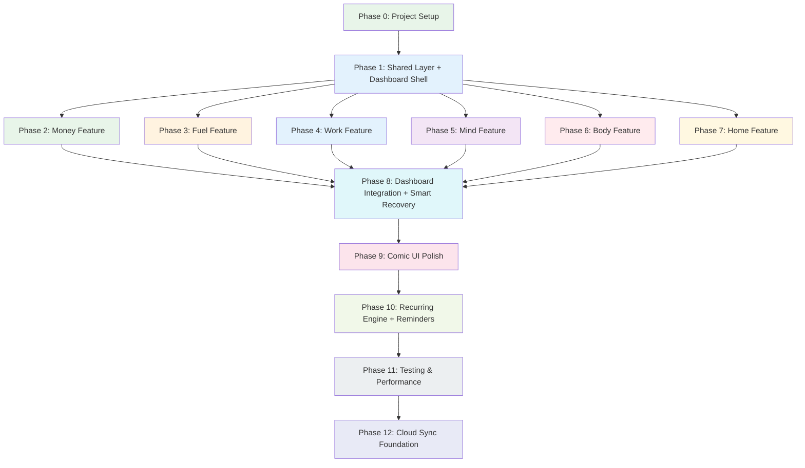

# LifePanel - Implementation Plan

## Document Info
| Field | Value |
|-------|-------|
| **Last Updated** | 2026-02-14 |
| **Total Phases** | 13 (Phase 0-12) |
| **Approach** | Iterative, feature-by-feature |
| **Status** | Draft |

---

## 1. Overview

LifePanel is built in 13 sequential phases, each delivering a vertical slice of functionality. Phases are designed so that each one produces a runnable app that builds on the previous phase. The first three phases (0-2) establish the foundation and the first feature (Money), after which the remaining five features follow a predictable pattern.

### Guiding Principles

1. **Vertical Slices**: Each phase delivers a complete feature from domain to UI. No "build all models first, then all UI later."
2. **Always Runnable**: After every phase, `flutter run` produces a working app.
3. **Test As You Go**: Each phase includes tests for the code it introduces. No "testing phase" at the end.
4. **Comic From Day One**: The comic component library is built in Phase 1 and used by every subsequent phase.
5. **Sequential Pages**: Within each feature phase, pages are built one at a time: domain -> data -> provider -> page -> tests -> next page.

---

## 2. Phase Dependency Diagram



**Key Dependencies**:
- Phase 1 is the prerequisite for all feature phases (2-7).
- Feature phases (2-7) are sequentially ordered but technically independent after Phase 1. The sequential order is chosen to build the most-used features first and establish patterns early.
- Phase 8 requires all feature phases (2-7) to be complete.
- Phases 9-12 are strictly sequential.

---

## 3. Detailed Phase Plans

---

### Phase 0: Project Setup

**Goal**: Establish the project skeleton, dependencies, folder structure, and documentation so that development can begin immediately.

**Estimated Duration**: 1 session

#### Tasks

- [ ] **0.1** Configure `pubspec.yaml` with all dependencies:
  ```yaml
  dependencies:
    flutter_riverpod: ^3.0.0
    riverpod_annotation: ^3.0.0
    isar: ^4.0.0              # isar_community
    isar_flutter_libs: ^4.0.0
    get_it: ^8.0.0
    fpdart: ^2.0.0
    go_router: ^14.0.0
    fl_chart: ^0.70.0
    flutter_animate: ^4.5.0
    flame: ^1.22.0
    uuid: ^4.5.0
    path_provider: ^2.1.0
    flutter_local_notifications: ^18.0.0
    intl: ^0.19.0
    equatable: ^2.0.0
    json_annotation: ^4.9.0
  dev_dependencies:
    build_runner: ^2.4.0
    riverpod_generator: ^3.0.0
    isar_generator: ^4.0.0
    json_serializable: ^6.8.0
    flutter_test: sdk: flutter
    mockito: ^5.4.0
    build_runner: ^2.4.0
    mocktail: ^1.0.0
  ```
- [ ] **0.2** Create complete folder structure (see architecture.md Section 4)
- [ ] **0.3** Write documentation files (PROGRESS.md, prd.md, architecture.md, data-model.md, api-design.md, implementation-plan.md)
- [ ] **0.4** Write CLAUDE.md with project context, conventions, and rules
- [ ] **0.5** Write `.claude/` commands and rules for AI-assisted development
- [ ] **0.6** Create starter Dart files:
  - `lib/main.dart` -- entry point calling bootstrap
  - `lib/app.dart` -- MaterialApp.router with comic theme
  - `lib/bootstrap.dart` -- Isar init, get_it setup, runApp
  - `lib/core/error/failures.dart` -- Failure sealed class
  - `lib/core/usecase/usecase.dart` -- Base UseCase interface
  - `lib/core/enums/life_area.dart` -- LifeArea and SubArea enums
  - `lib/core/router/app_router.dart` -- GoRouter stub with dashboard route
  - `lib/core/di/injection_container.dart` -- get_it stub
- [ ] **0.7** Verify `flutter run` succeeds (shows blank app with comic theme placeholder)
- [ ] **0.8** Run `flutter analyze` -- zero issues
- [ ] **0.9** Commit and push to GitHub

#### Verification

```bash
flutter pub get
flutter analyze          # 0 issues
flutter run              # app launches
flutter test             # all tests pass (trivial at this stage)
```

---

### Phase 1: Shared Layer + Dashboard Shell

**Goal**: Build the TrackableEntry system, shared repositories, comic component library, and dashboard shell. After this phase, the app has a functional dashboard with placeholder data and navigation to 6 area stubs.

**Estimated Duration**: 3-4 sessions

#### Tasks

**1A: Shared Domain Layer**
- [ ] **1A.1** Implement `TrackableEntry` entity (immutable, with copyWith)
- [ ] **1A.2** Implement `Category` entity
- [ ] **1A.3** Implement `Subcategory` entity
- [ ] **1A.4** Implement `RecurringRule` entity
- [ ] **1A.5** Implement `Reminder` entity
- [ ] **1A.6** Define `TrackableRepository` interface (all method signatures)
- [ ] **1A.7** Define `CategoryRepository` interface
- [ ] **1A.8** Define `RecurringRepository` interface
- [ ] **1A.9** Define `ReminderRepository` interface
- [ ] **1A.10** Implement shared use cases:
  - `AddEntry`
  - `GetEntries`
  - `GetEntriesByArea`
  - `GetEntriesByDateRange`
  - `UpdateEntry`
  - `DeleteEntry`
  - `DetectGaps`
  - `BulkAddEntries`
  - `ManageCategories`
  - `ProcessRecurringRules`

**1B: Shared Data Layer**
- [ ] **1B.1** Implement `TrackableEntryModel` (Isar collection + toEntity/fromEntity)
- [ ] **1B.2** Implement `CategoryModel`
- [ ] **1B.3** Implement `SubcategoryModel`
- [ ] **1B.4** Implement `RecurringRuleModel`
- [ ] **1B.5** Implement `ReminderModel`
- [ ] **1B.6** Implement `TrackableLocalDataSource` + `TrackableLocalDataSourceImpl`
- [ ] **1B.7** Implement `CategoryLocalDataSource` + impl
- [ ] **1B.8** Implement `RecurringLocalDataSource` + impl
- [ ] **1B.9** Implement `ReminderLocalDataSource` + impl
- [ ] **1B.10** Implement `TrackableRepositoryImpl`
- [ ] **1B.11** Implement `CategoryRepositoryImpl`
- [ ] **1B.12** Implement `RecurringRepositoryImpl`
- [ ] **1B.13** Implement `ReminderRepositoryImpl`
- [ ] **1B.14** Run `dart run build_runner build --delete-conflicting-outputs`
- [ ] **1B.15** Update `injection_container.dart` with all shared registrations
- [ ] **1B.16** Update `bootstrap.dart` to open Isar with all schemas and call DI init

**1C: Comic Component Library**
- [ ] **1C.1** Add font assets (Bangers, Comic Neue) to `assets/fonts/` and `pubspec.yaml`
- [ ] **1C.2** Implement `comic_theme.dart` (ThemeData with comic fonts, colors, component themes)
- [ ] **1C.3** Implement `comic_colors.dart` (area-specific color palettes)
- [ ] **1C.4** Implement `comic_typography.dart` (text styles)
- [ ] **1C.5** Implement `comic_constants.dart` (border widths, shadow offsets, corner radii)
- [ ] **1C.6** Build core comic widgets:
  - `comic_card.dart` -- black border, drop shadow, content slot
  - `comic_button.dart` -- bold button with press animation
  - `comic_scaffold.dart` -- page scaffold with halftone background
  - `comic_app_bar.dart` -- app bar with comic font, area colors
  - `comic_text_field.dart` -- text input with comic border
  - `comic_chip.dart` -- category/tag chip
  - `comic_toggle.dart` -- toggle switch
  - `comic_dialog.dart` -- dialog with optional speech bubble mode
  - `comic_bottom_sheet.dart` -- bottom sheet with comic border top
  - `comic_snackbar.dart` -- snackbar with onomatopoeia option
- [ ] **1C.7** Build composite comic widgets:
  - `comic_calendar.dart` -- date picker with comic styling
  - `comic_keypad.dart` -- numeric keypad
  - `comic_pie_chart.dart` -- fl_chart pie with comic wrapper
  - `comic_line_chart.dart` -- fl_chart line with comic wrapper
  - `comic_bar_chart.dart` -- fl_chart bar with comic wrapper
  - `comic_progress_ring.dart` -- circular progress indicator
  - `comic_category_picker.dart` -- grid category selector
  - `comic_empty_state.dart` -- empty state with speech bubble
  - `comic_error_panel.dart` -- error display with comic styling
- [ ] **1C.8** Build animation utilities:
  - `onomatopoeia.dart` -- POW!, BOOM!, WHOOSH! overlay widgets
  - `page_transitions.dart` -- comic panel slide/zoom transitions
  - `comic_shimmer.dart` -- loading shimmer effect

**1D: Dashboard Shell**
- [ ] **1D.1** Implement shared Riverpod providers (entries_provider, categories_provider)
- [ ] **1D.2** Build `DashboardPage` with horizontal PageView (3 screens)
- [ ] **1D.3** Build `LifeOverviewScreen` (Screen 1) with placeholder Flame game or static Flutter fallback showing 6 pie chart placeholders
- [ ] **1D.4** Build `AreaSnapshotsScreen` (Screen 2) with 6 tappable grid cells
- [ ] **1D.5** Build `DailyFeedScreen` (Screen 3) with empty state
- [ ] **1D.6** Create 6 area stub pages (MoneyDashboardPage, FuelDashboardPage, etc.) with "Coming Soon" comic empty states
- [ ] **1D.7** Configure GoRouter with all routes (dashboard, area stubs)
- [ ] **1D.8** Wire up navigation from dashboard to area stubs

**1E: Tests**
- [ ] **1E.1** Unit tests for all shared use cases
- [ ] **1E.2** Unit tests for shared repository implementations (with mock datasources)
- [ ] **1E.3** Widget tests for DashboardPage and navigation

#### Verification

```bash
dart run build_runner build --delete-conflicting-outputs
flutter analyze          # 0 issues
flutter test             # all shared tests pass
flutter run              # dashboard loads with 3 screens, navigation works
```

---

### Phase 2: Money Feature

**Goal**: Build the complete Money feature with all pages. This is the most complex feature and establishes patterns for all subsequent features.

**Estimated Duration**: 4-5 sessions

#### Tasks

**2A: Money Domain**
- [ ] **2A.1** Implement `Account` entity
- [ ] **2A.2** Implement `Budget` entity (with `BudgetProgress` value object)
- [ ] **2A.3** Implement `Investment` entity
- [ ] **2A.4** Define `MoneyRepository` interface
- [ ] **2A.5** Implement money use cases:
  - `AddTransaction`
  - `GetTransactions`
  - `TransferFunds`
  - `CreateBudget`
  - `GetBudgetProgress`
  - `ManageAccounts`
  - `ReconcileBalance`
  - `GetMoneyOverview`

**2B: Money Data**
- [ ] **2B.1** Implement `AccountModel` (Isar collection)
- [ ] **2B.2** Implement `BudgetModel`
- [ ] **2B.3** Implement `InvestmentModel`
- [ ] **2B.4** Implement `MoneyLocalDataSource` + impl
- [ ] **2B.5** Implement `MoneyRepositoryImpl`
- [ ] **2B.6** Run build_runner
- [ ] **2B.7** Register money dependencies in `injection_container.dart`
- [ ] **2B.8** Seed default money categories (Food, Transport, Bills, Entertainment, etc.)

**2C: Money Presentation (page by page)**
- [ ] **2C.1** Implement `money_providers.dart` (all Riverpod providers for money)
- [ ] **2C.2** Build `MoneyDashboardPage`:
  - Net balance card
  - Today/week/month spending summary
  - Budget progress bars
  - Recent transactions list
  - FAB to Add Transaction
  - Navigation to sub-pages
- [ ] **2C.3** Build `AddTransactionPage`:
  - Amount input via `comic_keypad`
  - Category picker via `comic_category_picker`
  - Account selector
  - Date/time picker
  - Note field
  - Recurring toggle (creates RecurringRule if on)
  - Save button -> creates entry + updates account balance
- [ ] **2C.4** Build `AccountsPage`:
  - List of accounts with balances
  - Add account FAB -> bottom sheet form
  - Edit account on tap
  - Account balance history (optional chart)
- [ ] **2C.5** Build `BudgetPage`:
  - List of active budgets with progress bars
  - Add budget button -> form with category, amount, period
  - Budget detail on tap (entries for that category this period)
- [ ] **2C.6** Build `InvestmentsPage`:
  - List of investments with current values
  - Add/edit investment
  - Total portfolio value
- [ ] **2C.7** Build `TransferPage`:
  - From account selector
  - To account selector
  - Amount keypad
  - Transfer button
- [ ] **2C.8** Build `RecordsPage`:
  - Full transaction history
  - Date range filter
  - Category filter
  - Search by note/payee
  - Infinite scroll with pagination
- [ ] **2C.9** Build `MoneyCategoriesPage`:
  - List of money categories with subcategories
  - Add/edit category
  - Reorder via drag-and-drop
  - Deactivate category

**2D: Money Tests**
- [ ] **2D.1** Unit tests for all money use cases
- [ ] **2D.2** Unit tests for MoneyRepositoryImpl
- [ ] **2D.3** Widget tests for AddTransactionPage (keypad interaction, save flow)
- [ ] **2D.4** Widget tests for MoneyDashboardPage

#### Verification

```bash
dart run build_runner build --delete-conflicting-outputs
flutter analyze
flutter test
flutter run              # Money feature fully functional
```

---

### Phase 3: Fuel Feature

**Goal**: Build the complete Fuel (nutrition) feature.

**Estimated Duration**: 3-4 sessions

#### Tasks

**3A: Fuel Domain**
- [ ] **3A.1** Implement `Recipe`, `Ingredient` entities
- [ ] **3A.2** Implement `GroceryItem` entity
- [ ] **3A.3** Implement `DietPlan` entity
- [ ] **3A.4** Define `FuelRepository` interface
- [ ] **3A.5** Implement fuel use cases: `LogMeal`, `LogLiquid`, `ManageRecipes`, `ManageGroceries`, `CreateMealPlan`, `SetDietPlan`, `GetFuelOverview`

**3B: Fuel Data**
- [ ] **3B.1** Implement Isar models for Recipe, Ingredient, GroceryItem, DietPlan
- [ ] **3B.2** Implement `FuelLocalDataSource` + impl
- [ ] **3B.3** Implement `FuelRepositoryImpl`
- [ ] **3B.4** Run build_runner, register dependencies
- [ ] **3B.5** Seed default fuel categories (Breakfast, Lunch, Dinner, Snack, etc.)

**3C: Fuel Presentation (page by page)**
- [ ] **3C.1** Implement `fuel_providers.dart`
- [ ] **3C.2** Build `FuelDashboardPage` (calories today, water ring, macros, recent meals)
- [ ] **3C.3** Build `MealsPage` (log meal, history list, daily calorie bar)
- [ ] **3C.4** Build `LiquidsPage` (water tracker with glass increments and goal ring)
- [ ] **3C.5** Build `SupplementsPage` (log supplement, daily checklist)
- [ ] **3C.6** Build `RecipesPage` (browse/add recipes with ingredients and nutrition)
- [ ] **3C.7** Build `GroceriesPage` (shopping list with checkboxes, pantry tab)
- [ ] **3C.8** Build `MealPrepPage` (7-day x 4-meal grid planner)
- [ ] **3C.9** Build `DietPage` (set calorie/macro targets, adherence chart)

**3D: Fuel Tests**
- [ ] **3D.1** Unit tests for fuel use cases
- [ ] **3D.2** Widget tests for MealsPage and LiquidsPage

#### Verification

```bash
dart run build_runner build --delete-conflicting-outputs
flutter analyze && flutter test && flutter run
```

---

### Phase 4: Work Feature

**Goal**: Build the complete Work feature.

**Estimated Duration**: 3-4 sessions

#### Tasks

**4A: Work Domain**
- [ ] **4A.1** Implement `Task`, `TimeClock`, `Alarm`, `CalendarEvent`, `CareerGoal` entities
- [ ] **4A.2** Define `WorkRepository` interface
- [ ] **4A.3** Implement work use cases: `ManageTasks`, `PunchInOut`, `ManageAlarms`, `ManageCalendarEvents`, `ManageCareerGoals`, `GetWorkOverview`

**4B: Work Data**
- [ ] **4B.1** Implement Isar models for all work entities
- [ ] **4B.2** Implement `WorkLocalDataSource` + impl
- [ ] **4B.3** Implement `WorkRepositoryImpl`
- [ ] **4B.4** Run build_runner, register dependencies
- [ ] **4B.5** Seed default work categories

**4C: Work Presentation (page by page)**
- [ ] **4C.1** Implement `work_providers.dart`
- [ ] **4C.2** Build `WorkDashboardPage`
- [ ] **4C.3** Build `TasksPage` (list view + kanban board with drag-and-drop)
- [ ] **4C.4** Build `ClockPage` (punch in/out with running timer, history)
- [ ] **4C.5** Build `AlarmsPage` (list of alarms, add/toggle)
- [ ] **4C.6** Build `CalendarPage` (day/week/month views, add events)
- [ ] **4C.7** Build `CareerPage` (goals with milestone tracking)

**4D: Work Tests**
- [ ] **4D.1** Unit tests for work use cases
- [ ] **4D.2** Widget tests for TasksPage and ClockPage

#### Verification

```bash
dart run build_runner build --delete-conflicting-outputs
flutter analyze && flutter test && flutter run
```

---

### Phase 5: Mind Feature

**Goal**: Build the complete Mind feature.

**Estimated Duration**: 2-3 sessions

#### Tasks

**5A: Mind Domain**
- [ ] **5A.1** Implement `MoodEntry`, `JournalEntry`, `SocialInteraction`, `StressLevel` entities
- [ ] **5A.2** Define `MindRepository` interface
- [ ] **5A.3** Implement mind use cases: `LogMood`, `ManageJournal`, `LogSocialInteraction`, `LogStress`, `GetMindOverview`

**5B: Mind Data**
- [ ] **5B.1** Implement Isar models for all mind entities
- [ ] **5B.2** Implement `MindLocalDataSource` + impl
- [ ] **5B.3** Implement `MindRepositoryImpl`
- [ ] **5B.4** Run build_runner, register dependencies

**5C: Mind Presentation (page by page)**
- [ ] **5C.1** Implement `mind_providers.dart`
- [ ] **5C.2** Build `MindDashboardPage` (mood trend, journal streak, stress indicator)
- [ ] **5C.3** Build `MoodPage` (emoji picker/slider, history chart, mood triggers)
- [ ] **5C.4** Build `JournalPage` (rich text editor, tags, search, history)
- [ ] **5C.5** Build `SocialPage` (log interactions, history list)
- [ ] **5C.6** Build `StressPage` (stress meter, trigger logging, coping strategies, trends)

**5D: Mind Tests**
- [ ] **5D.1** Unit tests for mind use cases
- [ ] **5D.2** Widget tests for MoodPage and JournalPage

#### Verification

```bash
dart run build_runner build --delete-conflicting-outputs
flutter analyze && flutter test && flutter run
```

---

### Phase 6: Body Feature

**Goal**: Build the complete Body feature.

**Estimated Duration**: 3 sessions

#### Tasks

**6A: Body Domain**
- [ ] **6A.1** Implement `SleepEntry`, `Workout`, `MenstrualEntry`, `SkinHairEntry`, `HealthRecord` entities
- [ ] **6A.2** Define `BodyRepository` interface
- [ ] **6A.3** Implement body use cases: `LogSleep`, `LogWorkout`, `LogMenstrualEntry`, `LogSkinHairEntry`, `LogHealthRecord`, `GetBodyOverview`, `PredictNextPeriod`

**6B: Body Data**
- [ ] **6B.1** Implement Isar models for all body entities
- [ ] **6B.2** Implement `BodyLocalDataSource` + impl
- [ ] **6B.3** Implement `BodyRepositoryImpl`
- [ ] **6B.4** Run build_runner, register dependencies

**6C: Body Presentation (page by page)**
- [ ] **6C.1** Implement `body_providers.dart`
- [ ] **6C.2** Build `BodyDashboardPage` (sleep summary, workouts this week, cycle day, weight)
- [ ] **6C.3** Build `SleepPage` (log sleep/wake times, quality, weekly chart)
- [ ] **6C.4** Build `WorkoutPage` (log workout with exercises, sets, history)
- [ ] **6C.5** Build `MenstrualPage` (calendar view, symptoms, phase tracking, predictions)
- [ ] **6C.6** Build `SkinHairPage` (routine checklist, product tracking, condition log)
- [ ] **6C.7** Build `HealthRecordsPage` (weight chart, BP log, medication tracker, doctor visits)

**6D: Body Tests**
- [ ] **6D.1** Unit tests for body use cases (especially period prediction logic)
- [ ] **6D.2** Widget tests for SleepPage and WorkoutPage

#### Verification

```bash
dart run build_runner build --delete-conflicting-outputs
flutter analyze && flutter test && flutter run
```

---

### Phase 7: Home Feature

**Goal**: Build the complete Home feature.

**Estimated Duration**: 3 sessions

#### Tasks

**7A: Home Domain**
- [ ] **7A.1** Implement `CarRecord`, `GardenEntry`, `Pet`, `PetEntry`, `CleaningTask`, `HomeInventoryItem` entities
- [ ] **7A.2** Define `HomeRepository` interface
- [ ] **7A.3** Implement home use cases: `ManageCar`, `ManageGarden`, `ManagePets`, `ManageCleaning`, `ManageInventory`, `GetHomeOverview`

**7B: Home Data**
- [ ] **7B.1** Implement Isar models for all home entities
- [ ] **7B.2** Implement `HomeLocalDataSource` + impl
- [ ] **7B.3** Implement `HomeRepositoryImpl`
- [ ] **7B.4** Run build_runner, register dependencies

**7C: Home Presentation (page by page)**
- [ ] **7C.1** Implement `home_providers.dart`
- [ ] **7C.2** Build `HomeDashboardPage` (upcoming services, cleaning due, pet summary)
- [ ] **7C.3** Build `CarPage` (service log, add record, next service reminders)
- [ ] **7C.4** Build `GardenPage` (activity log, per-plant history)
- [ ] **7C.5** Build `PetsPage` (pet profiles, per-pet entries with tabs)
- [ ] **7C.6** Build `CleaningPage` (room-based checklists, schedule management)
- [ ] **7C.7** Build `HomeInventoryPage` (item list, warranty tracking, search)

**7D: Home Tests**
- [ ] **7D.1** Unit tests for home use cases
- [ ] **7D.2** Widget tests for PetsPage and CleaningPage

#### Verification

```bash
dart run build_runner build --delete-conflicting-outputs
flutter analyze && flutter test && flutter run
```

---

### Phase 8: Dashboard Integration + Smart Recovery

**Goal**: Replace dashboard placeholders with real data from all 6 features. Implement the Smart Recovery system for gap detection and bulk-fill.

**Estimated Duration**: 3-4 sessions

#### Tasks

**8A: Dashboard Screen 1 -- Life Overview**
- [ ] **8A.1** Implement Flame `LifeOverviewGame` with yoga figure sprite/animation
- [ ] **8A.2** Implement `ProgressPieComponent` x 6 with real completion data
- [ ] **8A.3** Wire pie chart tap detection to GoRouter navigation
- [ ] **8A.4** Implement data bridge: Riverpod providers -> Flame game
- [ ] **8A.5** Implement lifecycle management (pause/resume on page scroll)
- [ ] **8A.6** Build static Flutter fallback for low-end devices

**8B: Dashboard Screen 2 -- Area Snapshots**
- [ ] **8B.1** Create overview providers for each area (calls respective getOverview)
- [ ] **8B.2** Build mini-chart widgets for each area:
  - Money: net balance + spending trend sparkline
  - Fuel: calorie progress bar + water ring
  - Work: tasks done / total + hours worked bar
  - Mind: mood emoji + trend sparkline
  - Body: sleep hours + workout count
  - Home: cleaning tasks due + upcoming services count
- [ ] **8B.3** Wire grid cells to navigate to area dashboards

**8C: Dashboard Screen 3 -- Daily Feed**
- [ ] **8C.1** Implement `watchTodayEntries` stream provider
- [ ] **8C.2** Build time-of-day grouping logic (Morning/Afternoon/Evening/Night)
- [ ] **8C.3** Build `EntryTile` widget that renders any TrackableEntry with area icon and appropriate summary
- [ ] **8C.4** Implement quick-add FAB with area selector bottom sheet
- [ ] **8C.5** Add Smart Recovery banner (see 8D)

**8D: Smart Recovery**
- [ ] **8D.1** Implement gap detection logic in `DetectGaps` and `DetectAllGaps` use cases
- [ ] **8D.2** Build `SmartRecoveryBanner` widget for Daily Feed
- [ ] **8D.3** Build `SmartRecoveryPage` with swipeable bulk-fill cards
- [ ] **8D.4** Implement area-specific bulk-fill card content:
  - Money: balance reconciliation form
  - Fuel: quick meal/water entry per missed day
  - Work: "Did you work?" yes/no + hours
  - Mind: mood slider per missed day
  - Body: sleep times per missed night
  - Home: cleaning checklist per missed day
- [ ] **8D.5** Implement `BulkAddEntries` use case for batch insert
- [ ] **8D.6** Implement money reconciliation flow (ReconcileBalance use case)
- [ ] **8D.7** Add welcome-back messaging (no guilt, encouraging tone)

**8E: Integration Tests**
- [ ] **8E.1** Integration test: log entries in all 6 areas, verify dashboard shows correct data
- [ ] **8E.2** Integration test: simulate 3-day gap, verify Smart Recovery detects and fills

#### Verification

```bash
dart run build_runner build --delete-conflicting-outputs
flutter analyze && flutter test
flutter test integration_test/
flutter run              # Dashboard shows real data, Smart Recovery works
```

---

### Phase 9: Comic UI Polish

**Goal**: Refine the visual identity across the entire app. Ensure every screen looks and feels like a comic book.

**Estimated Duration**: 2-3 sessions

#### Tasks

- [ ] **9.1** Audit every page for comic theme consistency
- [ ] **9.2** Refine comic color palette (ensure sufficient contrast, visual harmony)
- [ ] **9.3** Polish halftone dot pattern backgrounds (subtle, not distracting)
- [ ] **9.4** Add speech bubble decorations to:
  - Empty states ("Nothing here yet!")
  - Onboarding hints ("Try logging your first expense!")
  - Tooltips
- [ ] **9.5** Implement bold outlines and drop shadows consistently
- [ ] **9.6** Add onomatopoeia animations:
  - "KA-CHING!" when saving a transaction
  - "POW!" when completing a task
  - "SPLASH!" when hitting water goal
  - "ZZZ..." when logging sleep
  - "BOOM!" when hitting a budget milestone
  - "WHOOSH!" on page transitions
- [ ] **9.7** Implement custom page transitions (comic panel slide/zoom effects via GoRouter)
- [ ] **9.8** Design and implement empty state illustrations for each area
- [ ] **9.9** Create splash screen with LifePanel logo and comic styling
- [ ] **9.10** Polish all comic widgets (refine border radii, shadow intensity, animation timing)
- [ ] **9.11** Verify 60fps during all animations (profile and optimize)

#### Verification

```bash
flutter run --profile    # Check frame rates during animations
# Manual visual review of every page
```

---

### Phase 10: Recurring Engine + Reminders

**Goal**: Implement background processing for recurring rules and local notification reminders.

**Estimated Duration**: 2 sessions

#### Tasks

**10A: Recurring Engine**
- [ ] **10A.1** Implement recurring rule processing logic in `ProcessRecurringRules` use case:
  - Query all active rules where `nextDueDate <= now`
  - For each rule, clone the template entry with the correct timestamp
  - Insert the new entry
  - Advance `nextDueDate` based on type/interval/daysOfWeek/dayOfMonth
  - Increment `occurrenceCount`
  - Deactivate if `maxOccurrences` reached or `endDate` passed
- [ ] **10A.2** Call `ProcessRecurringRules` during `bootstrap.dart` (on every app open)
- [ ] **10A.3** Handle edge cases:
  - Rule due multiple times (app not opened for days) -- generate all missed entries
  - Template entry was deleted -- deactivate the rule
  - Rule with specific days of week -- only generate for matching days
- [ ] **10A.4** Build recurring rule management UI:
  - View active recurring rules
  - Edit rule (change frequency, end date)
  - Deactivate/delete rule

**10B: Reminders (Local Notifications)**
- [ ] **10B.1** Configure `flutter_local_notifications` for Android and iOS
- [ ] **10B.2** Implement notification scheduling in `ReminderRepositoryImpl`
- [ ] **10B.3** Implement `syncNotifications()` -- sync all active Reminder entities with scheduled notifications
- [ ] **10B.4** Implement notification tap handling:
  - Parse notification payload (area + subArea + linkedEntryId)
  - Navigate to the appropriate page via GoRouter
- [ ] **10B.5** Build reminder management UI:
  - View active reminders
  - Add/edit reminder (area, time, repeat pattern, title, body)
  - Toggle reminder active/inactive
  - Delete reminder
- [ ] **10B.6** Request notification permissions (Android 13+, iOS)

**10C: Tests**
- [ ] **10C.1** Unit tests for recurring rule processing (all frequency types, edge cases)
- [ ] **10C.2** Unit tests for nextDueDate calculation
- [ ] **10C.3** Unit tests for reminder scheduling logic

#### Verification

```bash
flutter analyze && flutter test
flutter run              # Create a daily recurring expense; force restart; verify entry generated
```

---

### Phase 11: Testing & Performance

**Goal**: Achieve test coverage targets, optimize performance, and finalize the app for release readiness.

**Estimated Duration**: 3-4 sessions

#### Tasks

**11A: Test Coverage**
- [ ] **11A.1** Run coverage report: `flutter test --coverage`
- [ ] **11A.2** Identify gaps in domain layer coverage (target: 80%)
- [ ] **11A.3** Identify gaps in data layer coverage (target: 80%)
- [ ] **11A.4** Write missing unit tests for domain use cases
- [ ] **11A.5** Write missing unit tests for repository implementations
- [ ] **11A.6** Write widget tests for all dashboard pages (6 area dashboards + main)
- [ ] **11A.7** Write widget tests for high-traffic pages (AddTransaction, Meals, Tasks, Mood)
- [ ] **11A.8** Write integration tests for critical flows:
  - Log an expense end-to-end
  - Create a budget and verify progress updates
  - Log a full day of meals and verify calorie totals
  - Punch in/out and verify hours
  - Smart Recovery flow end-to-end
  - Recurring rule generation end-to-end

**11B: Performance Optimization**
- [ ] **11B.1** Profile cold startup time (target: < 2s)
  - Optimize Isar schema opening
  - Defer non-critical initialization
  - Minimize splash screen duration
- [ ] **11B.2** Profile Isar query performance
  - Ensure all queries use indexes (no full-collection scans)
  - Benchmark date-range queries with 10K+ entries
  - Add missing indexes if needed
- [ ] **11B.3** Profile widget rebuild efficiency
  - Use `flutter run --profile` and DevTools
  - Identify unnecessary rebuilds
  - Add `select()` to Riverpod watchers where needed
  - Use `const` constructors where possible
- [ ] **11B.4** Profile Flame dashboard performance
  - Ensure game pauses when off-screen
  - Optimize sprite rendering
  - Test on low-end devices
- [ ] **11B.5** Profile memory usage
  - Check for memory leaks in stream subscriptions
  - Verify Riverpod auto-dispose is working
  - Monitor Isar watcher memory usage
- [ ] **11B.6** Optimize app binary size
  - Tree-shake unused assets
  - Optimize image assets
  - Check for unused dependencies

**11C: Quality Assurance**
- [ ] **11C.1** Accessibility audit:
  - All interactive elements have semantic labels
  - Touch targets >= 48x48dp
  - Color contrast meets WCAG AA
  - Screen reader can navigate all pages
- [ ] **11C.2** Error boundary handling:
  - Add global error handler in `main.dart`
  - All async operations show appropriate error UI
  - Isar connection loss handled gracefully
- [ ] **11C.3** Edge case testing:
  - App behavior with empty database
  - App behavior with 10K+ entries
  - Date boundary (midnight) handling
  - Timezone change handling
  - Device locale change handling
- [ ] **11C.4** App icon design and implementation (Android adaptive icon + iOS icon)

#### Verification

```bash
flutter test --coverage
# genhtml coverage/lcov.info -o coverage/html
# Open coverage/html/index.html -- verify >= 80% domain+data
flutter run --profile    # Verify startup < 2s, 60fps
flutter build apk --release
flutter build ios --release  # (on macOS)
```

---

### Phase 12: Cloud Sync Foundation (Optional)

**Goal**: Lay the groundwork for future cloud sync without implementing full sync. Provide JSON export/import as an immediate data portability feature.

**Estimated Duration**: 2-3 sessions

#### Tasks

**12A: Export/Import**
- [ ] **12A.1** Implement JSON export for all Isar collections:
  - Export all TrackableEntry records
  - Export all Category/Subcategory records
  - Export all area-specific entity records
  - Export RecurringRule and Reminder records
  - Bundle into a single JSON file with schema version header
- [ ] **12A.2** Implement JSON import:
  - Parse JSON file
  - Validate schema version
  - Deduplicate by UUID (skip entries that already exist)
  - Insert missing entries
  - Handle conflicts (newer entry wins by updatedAt)
- [ ] **12A.3** Build export/import UI:
  - Settings page with "Export Data" and "Import Data" buttons
  - Export: file picker for save location, progress indicator
  - Import: file picker for JSON file, preview of what will be imported, confirm
- [ ] **12A.4** Tests for export/import (round-trip: export -> clear DB -> import -> verify)

**12B: Sync Interface (Stubs Only)**
- [ ] **12B.1** Define abstract `SyncService` interface in domain layer:
  ```dart
  abstract class SyncService {
    Future<Either<Failure, void>> pushChanges(List<SyncDelta> deltas);
    Future<Either<Failure, List<SyncDelta>>> pullChanges(DateTime since);
    Future<Either<Failure, SyncStatus>> getStatus();
  }
  ```
- [ ] **12B.2** Define `SyncDelta` entity (uuid, collection, action, data, timestamp)
- [ ] **12B.3** Create stub implementations:
  - `OneDriveSyncService` (stub)
  - `GoogleDriveSyncService` (stub)
  - `ICloudSyncService` (stub)
- [ ] **12B.4** Document conflict resolution strategy:
  - Last-write-wins based on `updatedAt`
  - UUID-based deduplication
  - Soft-delete propagation
- [ ] **12B.5** Add sync status UI placeholder in Settings

#### Verification

```bash
flutter analyze && flutter test
flutter run              # Export -> verify JSON file -> Import on fresh install -> verify data
```

---

## 4. Risk Mitigation

| Risk | Likelihood | Impact | Mitigation |
|------|-----------|--------|------------|
| Isar Community fork becomes unmaintained | Low | High | Monitor GitHub activity. Abstract data layer allows swapping to Hive/Drift/ObjectBox if needed. |
| Riverpod 3 breaking changes | Low | Medium | Pin exact versions in pubspec.yaml. Use codegen for migration assistance. |
| Flame performance on low-end devices | Medium | Medium | Static Flutter fallback for Dashboard Screen 1. Profile early in Phase 8. |
| Comic UI slows down development | Medium | Medium | Build component library upfront in Phase 1. Features compose, not create. |
| Scope creep in individual features | High | Medium | Strict P0/P1 prioritization. Defer P1 sub-features to post-MVP if needed. |
| Isar database grows too large | Low | Medium | Monitor size during Phase 11. Implement data archiving strategy if needed. |
| build_runner codegen is slow | Medium | Low | Use `watch` mode during development. Only run full build before commits. |
| Too many Isar collections impact startup | Low | Medium | Profile during Phase 11. Isar handles 20+ collections well by design. |
| Comic fonts not available / licensing issues | Low | Low | Bangers and Comic Neue are both Google Fonts (OFL license). Bundle in assets. |
| Feature phases take longer than estimated | High | Medium | Phases 5-7 (Mind, Body, Home) can be deferred post-MVP if Phase 2-4 overrun. |

---

## 5. Development Session Workflow

Each coding session should follow this pattern:

1. **Start**: Pull latest, `flutter pub get`, `dart run build_runner build --delete-conflicting-outputs`
2. **Plan**: Review current phase, identify next 2-3 tasks
3. **Build**: Implement tasks following domain -> data -> presentation -> tests order
4. **Verify**: Run `flutter analyze`, `flutter test`, `flutter run`
5. **Update**: Update `docs/PROGRESS.md` with completed tasks
6. **Commit**: Meaningful commit message referencing phase and task IDs

---

## 6. Key Commands Reference

```bash
# Initial setup
flutter pub get
dart run build_runner build --delete-conflicting-outputs

# Development
dart run build_runner watch --delete-conflicting-outputs  # auto-regen on save
flutter run                                                # run app
flutter run --profile                                      # run with profiling

# Testing
flutter test                                               # all tests
flutter test test/shared/                                  # shared layer tests only
flutter test test/features/money/                          # money feature tests only
flutter test --coverage                                    # with coverage report
flutter test integration_test/                             # integration tests

# Analysis
flutter analyze                                            # static analysis
dart fix --apply                                           # auto-fix lint issues

# Build
flutter build apk --release                                # Android release
flutter build ios --release                                # iOS release (macOS only)
flutter build appbundle --release                          # Android App Bundle

# Cleanup
flutter clean
dart run build_runner clean
```

---

## 7. Estimated Timeline Summary

| Phase | Description | Estimated Sessions | Cumulative |
|-------|-------------|-------------------|------------|
| 0 | Project Setup | 1 | 1 |
| 1 | Shared Layer + Dashboard Shell | 3-4 | 4-5 |
| 2 | Money Feature | 4-5 | 8-10 |
| 3 | Fuel Feature | 3-4 | 11-14 |
| 4 | Work Feature | 3-4 | 14-18 |
| 5 | Mind Feature | 2-3 | 16-21 |
| 6 | Body Feature | 3 | 19-24 |
| 7 | Home Feature | 3 | 22-27 |
| 8 | Dashboard Integration + Smart Recovery | 3-4 | 25-31 |
| 9 | Comic UI Polish | 2-3 | 27-34 |
| 10 | Recurring Engine + Reminders | 2 | 29-36 |
| 11 | Testing & Performance | 3-4 | 32-40 |
| 12 | Cloud Sync Foundation (Optional) | 2-3 | 34-43 |

**Total Estimated**: 34-43 development sessions

A "session" is approximately 2-4 hours of focused development time, equivalent to one Claude Code session with significant context.
